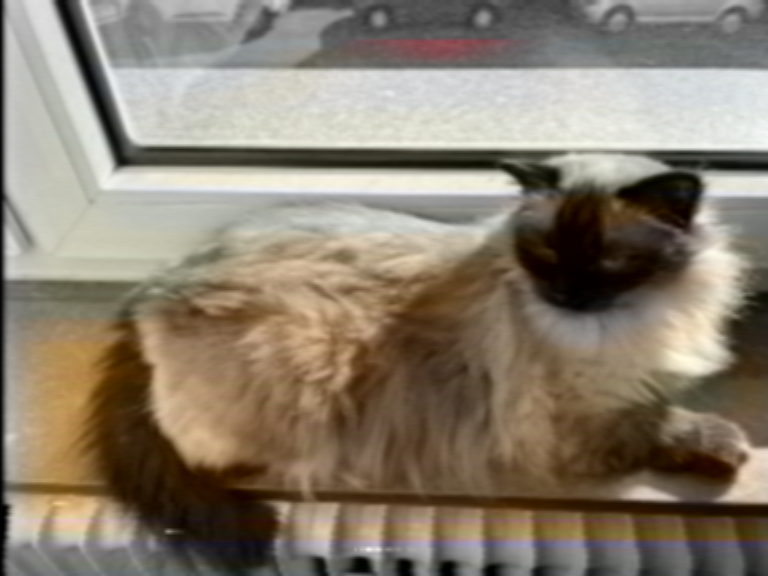

# Analogue Artifacts Simulation (AAS) on multiple images/ videos using `ntsc-rs`

## TOC

- [Advance Organizer](#advance-organizer)
- [Goal](#goal)
- [Use cases](#use-cases)
- [Overview](#overview)
- [Implementation](#implementation)
- [Call](#call)
- [Options](#options)
- [Artifacts profiles and presets](#artifacts-profiles-and-presets)
- [Prerequisites of statistical work](#prerequisites-of-statistical-work)
- [Statistical variation and handling of the spreadsheet](statistical-variation-and-handling-of-the-spreadsheet)
- [Excourse on "putting a probability distribution on possibility space"](#excourse-on-putting-a-probability-distribution-on-possibility-space)
	- [Qualitative case - draw random samples from categories](#qualitative-case-draw-random-samples-from-categories)
	- [Quantitative case - draw random samples from numeric spaces](#quantitative-case-draw-random-samples-from-numeric-spaces)
- [Statistical variation and handling the spreadsheet ](#statistical-variation-and-handling-the-spreadsheet)
- [Tweaking profiles via spreadsheet](#tweaking-profiles-via-spreadsheet)
	- [Statistical background (short)](#statistical-background)
		- [Categories (multiple, logical) ](#categories-multiple-logical)
		- [Linear increase (integer, float)](#linear-increase-integer-float)
		- [Non-linear increase ](#non-linear-increase)
- [Files](#files)
- [Installation of `R` and its dependencies](#installation-of-r)
	- ['ntsc-rs'](#ntsc-rs)
	- ['R'](#r)
	- ['R' packages](#r-packages)
- [Usage and Procedure](#usage-and-procedure)
- [Worked example ](#worked-examples)
- [Limitations](#limitations)
- [DISCLAIMER](#disclaimer)
- [TODOs](#todos)
- [License](#license)
- [Cited software and addons](#cited-software-and-addons)


## Advance Organizer


## Goal

The `R` scripts hosted here allow to script [`ntsc-rs`](https://ntsc.rs) for an arbitrary number of images or videos based on a profile (presets) using the `.json` format of `ntsc-rs`. It introduces a certain controllable amount of statistical variation arranged by the user using a simple spreadsheet. This ensures that each image (video) works with slightly different parameters within the tolerance space defined by the user. In the spreadsheet the user can configure how the variation should take place for **every possible parameter** of `ntsc-rs`.


## Use cases

Simulating old analogue artifacts can be used for various purposes (image, video):

- fun
- art
- layout and professional graphics
- fine-tuning of AI/ML models (creation of degradated material to match a training sample based on hi-res material)
	- upscale fine-tuning can be done for various model archs (e.g. [real-esrgan](https://github.com/xinntao/Real-ESRGAN), ...), easily applied by [neosr](https://github.com/neosr-project/neosr)
	- remove old analogue TV/ (S)VHS)/ betacam, ... artifacts from images or videos without upscaling

For AI/ML inference the [vsgan-tensorrt docker](https://github.com/styler00dollar/VSGAN-tensorrt-docker) engine is a good choice. It uses docker and the installation is therefor pretty straightforward. It requires a huge GPU whereas `ntsc-rs-cli` works multithreaded with CPU. For AI/ML preparation of images the script worked for more than several 10k images without any failure or break.

> [!IMPORTANT]
> If someone uses the AI/ML approach the most crucial factor is the manual and visually selection of source images. If artifacts should be removed the model has to be trained on real hi-res images so there is enough material to learn the difference between degraded and non-degraded images. This means a lot of time to invest, but even with image quality scores one cannot circumvent the manual visual inspection of images. Keep also in mind that upscale fine-tuning expects to prepare the material into tiles (e.g. 512x512) so that the whole model fine-tuning fits into the VRAM.


## Overview

The software [`ntsc-rs`](https://ntsc.rs) written in [`Rust`](https://www.rust-lang.org) allows users to simulate old analogue TV, (S)VHS, betacam, and other associated artifacts. Actually it should be named not as` ntsc` but as **analog artifacts simulation**, because the artifacts e.g. due to normal decay of magnetic tape originally occurs to PAL/ SECAM tapes as well, not just to NTSC tapes. And simulating pure analogue TV without any storage devices like video tapes can be done for PAL/ SECAM as well. The original basic work for `ntsc-rs` was realized by the [composite video simulator](https://github.com/joncampbell123/composite-video-simulator).

As a consequence of carefully applying the artifact related parameters to the original footage the outcome looks like an old (S)VHS tape/ TV/ ... with all visible and known artifacts in dependence to the degree and intensity of its configuration. The sum of those configs equals a profile, a set of presets.

Although `ntsc-rs` roots in [composite-video-simulator](https://github.com/joncampbell123/composite-video-simulator) and [ntscqt](https://github.com/JargeZ/ntscqt) it contains nowadays more and more sources of signal degradation. A short outline of typical artifacts along with screenshots can be found on the cited repos. Amongst those the typical characteristics of dot crawl, ringing, chroma/ luma delay error aka color bleeding, rainbow effects, chrominance noise, head switching noise, long/ extended play, luminance noise, and oversaturation can be simulated - to name only the most predominant artifacts. An extensive overview about video artficats can be found on the [AV artifact atlas](http://www.avartifactatlas.com/tags.html#video). The ultimate goal is to simulate every of those video artifacts.

`ntsc-rs` works as GUI and now with a cli version. Configurations are stored in `.json` files, ie. simple text files. One can find on the discussion forum of the github repo of `ntsc-rs` a lot of profiles for certain historical environments like VHS, SVHS, betacam, analogue TV and much more - carefully selected and developed by users and uploaded by them. Further [down](#TODOXXX) you can find a selection of published profiles. All of them can be used for simulation.

Some of the profiles may not include all newest parameters of `ntsc-rs`. For such cases one has to re-check with the GUI for changes, and test those on real material to understand how those new parameters not covered by the `.json` profile works.

The setup here allows to script the unattended generation of a large (arbitrarry) number of images or videos with a certain variation based on probabilities (see [below for details](#TODOXXX)). The scripts were developed and tested under [Debian Linux](https://www.debian.org) (`bookworm`, `12.9`) using ['R'](https://cran.r-project.org) version `4.4.2`.


## Implementation

The actual `R` functions to simulate and introduce statistical concepts are separated into

- creation of `.json` profile(s) based on statistics per image/ video by reading a base profile (spreadsheet, `.xlsx` format) which contains all statistical input for each parameter
- call of `ntsc-rs-cli` along with its usual parameters (see `ntsc-rs-cli --help` for a complete overview)

All options not covered by the `R` script call can be passed through without any cross-checks by the script directly to `ntsc-rs-cli` via the '-g OPTIONS' or '--other OPTIONS' so  can make use of them. A user has to take care that those calls are proper.


## Call

To call the `R` script via [`Rscript`](https://search.r-project.org/R/refmans/utils/html/Rscript.html) on the terminal is straightforward. The same can be achieved by using `R` directly and calling the functions manually using [aas_sim_manual.r](./aas_sim_manual.r). The `Rscript` bash call has multiple options.

<details>

<summary>Click here to get an output of the possible parameters of `ass_bash_sim_bash.r`</summary>

```bash
$  ./aas_sim_bash.r --help
usage: ./aas_sim_bash.r [-h] [-n NTSCRS] [-b BASEJSON] [-s STARTFOLDER]
                        [-t VALIDENDINGS] [-j] [-i SOURCEFOLDER]
                        [-m SMATERIAL] [-x OUTFOLDER] [-d] [-o] [-u EACH]
                        [-c COMPRESSIONLEVEL] [-q QUALITY] [-e ENCODINGSPEED]
                        [-p BITDEPTH] [-f FPS] [-l LENGTH] [-a] [-z SEED]
                        [-g OTHER] [-v] [-y]

options:
  -h, --help            show this help message and exit
  -n NTSCRS, --ntscrs NTSCRS
                        path to ntsc-rs-cli binary [default:
                        /usr/local/bin/ntsc-rs-cli]
  -b BASEJSON, --basejson BASEJSON
                        basejson xlsx sheet [default:
                        example/aas_basejson_profile-nanda.xlsx]
  -s STARTFOLDER, --startfolder STARTFOLDER
                        set start folder as a base [default: ]
  -t VALIDENDINGS, --validendings VALIDENDINGS
                        valid file endings (image: png, jpg, ... | video: mp4,
                        mkv, ...) [default: ('jpg', 'JPG', 'TIF', 'tif',
                        'BMP', 'bmp', 'PNG', 'png')]
  -j, --NOsingleframe   create no single frame as png ie. video [default:
                        False]
  -i SOURCEFOLDER, --sourcefolder SOURCEFOLDER
                        relative path to source files [default: image_source]
  -m SMATERIAL, --smaterial SMATERIAL
                        source material (images, videos) [default: image]
  -x OUTFOLDER, --outfolder OUTFOLDER
                        relative path to output folder [default: TEST_ntsc-rs-
                        OUT]
  -d, --dryrun          do not process anything / dry-run [default: True]
  -o, --NOoverwrite     do not overwrite existent files [default: False]
  -u EACH, --each EACH  image variations per image [default: 1]
  -c COMPRESSIONLEVEL, --compressionlevel COMPRESSIONLEVEL
                        compression level png (0=fast to 9=small) [default: 6]
  -q QUALITY, --quality QUALITY
                        video quality level h264 (max. 50) [default: 50]
  -e ENCODINGSPEED, --encodingspeed ENCODINGSPEED
                        encoding speed h264 (0-8) [default: 5]
  -p BITDEPTH, --bitdepth BITDEPTH
                        bit depth ffv1 codec h264 (8, 10, 12) [default: 8]
  -f FPS, --fps FPS     frames per second for (intermediate) video (h264)
                        [default: 25]
  -l LENGTH, --length LENGTH
                        length of intermediate video (h264) in MM:SS.MS
                        [default: 00:05.00]
  -a, --archive         use ffv1 archive codec [default: False]
  -z SEED, --seed SEED  seed for randomness [default: 996677]
  -g OTHER, --other OTHER
                        options to passthrough to ntsc-rs-cli [default: ]
  -v, --verbose         show more infos [default: True]
  -y, --fullrandom      create full random json profile [default: False]
```

</details>

## Options

The explanations of the options of the `R` script are the same for the manual as well as the bash version (see comments in [aas_sim_manual.r](./aas_sim_manual.r) that covers various scenarios of everyday usage. Some options make only sense in combination with other parameters, see man page of `ntsc-rs-cli` and associated tutorials.

<details>

<summary>Click here to see the commandline options of `ass_bash_sim_bash.r`</summary>

| Switch | Description | Default value |
| --- | --- | --- |
| `-n`, `--ntscrs` | path to `ntsc-rs-cli` | `/usr/local/bin/ntsc-rs-cli`|
| `-b`, `--basejson` | path to control sheet | `` |
| `-s`, `--startfolder` | base folder of image(s) or video(s) | `` |
| `-t`, `--validendings` | enabled file-endings for image [image: jpg,JPG,tif,TIF,bmp,BMP,png,PNG] and video [avi,AVI, mp4, MP4, mkv, MKV, vob, VOB] |
| `-j`, `--NOsingleframe` | create only single frame as png | `TRUE` |
| `-i`, `--sourcefolder` | relative path to source files | `image_source` for image and `video_source` for video |
| `-m`, `--smaterial` | source material (video, image) | `image` |
| `-x`, `--outfolder` | relative path to output folder | `ntsc-rs-OUT` |
| `-d`, `--dryrun` | do a dry-run | `FALSE` |
| `-o`, `--NOoverwrite` | do not overwrite existent files | `TRUE` |
| `-u`, `--each` | number of variations per image/ video | `1` |
| `-c`, `--compressionlevel` | only png (0=fastest, 9=smallest) | `6` |
| `-q`, `--quality` | h264 quality level (max. 50) | `50` |
| `-e`, `--encodingspeed` | h264 encoding speed (0...8) | `5` |
| `-p`, `--bitdepth` | ffv1 bit depth (8, 10, 12) | `8` |
| `-f`, `--fps` | framerate | `25` |
| `-l`, `--length` | duration in MM:SS.MS | `00:05.00` |
| `-a`, `--archive` | use ffv1 archive codec | `FALSE` |
| `-z`, `--seed` | seed for randomness | `996677` |
| `-g`, `--other` | pass through further options to `ntsc-rs-cli` | `` |
| `-v`, `--verbose` | put out more infos | `FALSE` |
| `-y`, `--fullrandom` | create a full random profile/ preset | `FALSE` |

</details>


## Artifact profiles and presets

The following profiles can be found on the github repo of `ntsc-rs`, section [discussion](https://github.com/valadaptive/ntsc-rs/discussions) and sub-section [presets](https://github.com/valadaptive/ntsc-rs/discussions/categories/presets). The credit goes to the selected users who developed and kindly published it. The `R` script [`svhs_sim_get-presets-bash.r`](./svhs_sim_get-presets-bash.r) collects all `zip` and `json` files from the github discussion sub-section [`presets`](https://github.com/valadaptive/ntsc-rs/discussions/categories/presets) of `ntsc-rs` and downloads them locally (see `aas_sim_get-presets-bash.r --help` for further options). Those are [status quo 2025-04-03]:

<details>

<summary>Click here to get a list with download links of `ntsc-rs` profiles.</summary>

- [80s-commercial.json](https://github.com/valadaptive/ntsc-rs/files/15410576/80s-commercial.json)
- [hs-u780-2.json](https://github.com/valadaptive/ntsc-rs/files/15443941/hs-u780-2.json)
- [TDK-EHG.json](https://github.com/valadaptive/ntsc-rs/files/15422887/TDK-EHG.json)
- [AV_EFCT.json](https://github.com/valadaptive/ntsc-rs/files/15423840/AV_EFCT.json)
- [AV_EFFECT2.json](https://github.com/valadaptive/ntsc-rs/files/15424950/AV_EFFECT2.json)
- [ccardnewest.json](https://github.com/valadaptive/ntsc-rs/files/15444099/ccardnewest.json)
- [ntsc-rs_cvbs6.json](https://github.com/valadaptive/ntsc-rs/files/15445236/ntsc-rs_cvbs6.json)
- [ANALOG_TV_EFFECT1.json](https://github.com/valadaptive/ntsc-rs/files/15459398/ANALOG_TV_EFFECT1.json)
- [bluecoolman_VCRRecordingV4.json](https://github.com/valadaptive/ntsc-rs/files/15474769/bluecoolman_VCRRecordingV4.json)
- [bluecoolman_VCRRecordingV5.json](https://github.com/user-attachments/files/16182866/bluecoolman_VCRRecordingV5.json)
- [dani.s.vhs.preset.v2.2.json](https://github.com/user-attachments/files/19110897/dani.s.vhs.preset.v2.2.json)
- [dani.s.vhs.preset.json](https://github.com/user-attachments/files/16193979/dani.s.vhs.preset.json)
- [dani.s.vhs.preset.v1.1.json](https://github.com/user-attachments/files/16283956/dani.s.vhs.preset.v1.1.json)
- [dani.s.vhs.preset.v1.2.json](https://github.com/user-attachments/files/16741689/dani.s.vhs.preset.v1.2.json)
- [dani.s.vhs.preset.v1.3.json](https://github.com/user-attachments/files/16874765/dani.s.vhs.preset.v1.3.json)
- [dani.s.vhs.preset.v1.4.json](https://github.com/user-attachments/files/17002772/dani.s.vhs.preset.v1.4.json)
- [dani.s.vhs.preset.v1.5.json](https://github.com/user-attachments/files/17117471/dani.s.vhs.preset.v1.5.json)
- [dani.s.vhs.preset.v1.6.json](https://github.com/user-attachments/files/17117472/dani.s.vhs.preset.v1.6.json)
- [dani.s.vhs.preset.v1.7.json](https://github.com/user-attachments/files/17117475/dani.s.vhs.preset.v1.7.json)
- [dani.s.vhs.preset.v1.8.json](https://github.com/user-attachments/files/17246501/dani.s.vhs.preset.v1.8.json)
- [dani.s.vhs.preset.v.1.9.zip](https://github.com/user-attachments/files/17778250/dani.s.vhs.preset.v.1.9.zip)
- [dani.s.vhs.preset.v2.0.json](https://github.com/user-attachments/files/18239317/dani.s.vhs.preset.v2.0.json)
- [dani.s.vhs.preset.v2.1.json](https://github.com/user-attachments/files/18495663/dani.s.vhs.preset.v2.1.json)
- [dani.s.vhs.preset.v2.2.json](https://github.com/user-attachments/files/19110897/dani.s.vhs.preset.v2.2.json)
- [AV2.json](https://github.com/user-attachments/files/16349411/AV2.json)
- [AV3.json](https://github.com/user-attachments/files/16362537/AV3.json)
- [EMTEC.E-240.Preset.v1.json](https://github.com/user-attachments/files/16444514/EMTEC.E-240.Preset.v1.json)
- [thrivervhsVersion1.json](https://github.com/user-attachments/files/16500835/thrivervhsVersion1.json)
- [Low-Power-NTSC.json](https://github.com/user-attachments/files/16561262/Low-Power-NTSC.json)
- [Worn-Tape2.json](https://github.com/user-attachments/files/16562244/Worn-Tape2.json)
- [OpenReel.json](https://github.com/user-attachments/files/16562760/OpenReel.json)
- [Rekcol.s.NTSC.Presets.zip](https://github.com/user-attachments/files/16614508/Rekcol.s.NTSC.Presets.zip)
- [OG.Rekcol.s.NTSC.Presets.zip](https://github.com/user-attachments/files/16614542/OG.Rekcol.s.NTSC.Presets.zip)
- [BetaMax.json](https://github.com/user-attachments/files/16576355/BetaMax.json)
- [Composite.json](https://github.com/user-attachments/files/16576356/Composite.json)
- [S-VHSEffectSP.json](https://github.com/user-attachments/files/16576357/S-VHSEffectSP.json)
- [U-Matic.WIP.json](https://github.com/user-attachments/files/16576358/U-Matic.WIP.json)
- [NTSC.Presets.zip](https://github.com/user-attachments/files/16756855/NTSC.Presets.zip)
- [1998-T120.json](https://github.com/user-attachments/files/16736977/1998-T120.json)
- [AV.Effect.V1.1.json](https://github.com/user-attachments/files/16751361/AV.Effect.V1.1.json)
- [VHS-SP.json](https://github.com/user-attachments/files/16842979/VHS-SP.json)
- [U-Matic.json](https://github.com/user-attachments/files/16842966/U-Matic.json)
- [VHS-VP.json](https://github.com/user-attachments/files/16842975/VHS-VP.json)
- [Worn-Tape3.json](https://github.com/user-attachments/files/16847777/Worn-Tape3.json)
- [B.S.E-300.HG.v1.json](https://github.com/user-attachments/files/16868190/B.S.E-300.HG.v1.json)
- [analog.drone.json](https://github.com/user-attachments/files/17121417/analog.drone.json)
- [analogtv.json](https://github.com/user-attachments/files/17171531/analogtv.json)
- [BetaCamSP.json](https://github.com/user-attachments/files/17177215/BetaCamSP.json)
- [BetaMax.json](https://github.com/user-attachments/files/17177178/BetaMax.json)
- [S-VHS-SP.json](https://github.com/user-attachments/files/17177179/S-VHS-SP.json)
- [ntsc-rs_svhsDamaged.json](https://github.com/user-attachments/files/17201719/ntsc-rs_svhsDamaged.json)
- [Basic.VHS.json](https://github.com/user-attachments/files/17264196/Basic.VHS.json)
- [Broken.Clear.json](https://github.com/user-attachments/files/17264197/Broken.Clear.json)
- [Clone.json](https://github.com/user-attachments/files/17264198/Clone.json)
- [Clone2.json](https://github.com/user-attachments/files/17264199/Clone2.json)
- [Damaged.json](https://github.com/user-attachments/files/17264200/Damaged.json)
- [Default.json](https://github.com/user-attachments/files/17264201/Default.json)
- [General.VHS.Effect.json](https://github.com/user-attachments/files/17264202/General.VHS.Effect.json)
- [HD.Television.json](https://github.com/user-attachments/files/17264203/HD.Television.json)
- [i_dont_see_anything.json](https://github.com/user-attachments/files/17264204/i_dont_see_anything.json)
- [Inverted.json](https://github.com/user-attachments/files/17264205/Inverted.json)
- [Lost.Chroma.json](https://github.com/user-attachments/files/17264206/Lost.Chroma.json)
- [LQ.Television.json](https://github.com/user-attachments/files/17264207/LQ.Television.json)
- [Noise.json](https://github.com/user-attachments/files/17264208/Noise.json)
- [Old.VHS.json](https://github.com/user-attachments/files/17264209/Old.VHS.json)
- [Scanlines.json](https://github.com/user-attachments/files/17264210/Scanlines.json)
- [TV.Static.json](https://github.com/user-attachments/files/17264211/TV.Static.json)
- [Untitled.json](https://github.com/user-attachments/files/17264212/Untitled.json)
- [Wavy.Image.json](https://github.com/user-attachments/files/17264213/Wavy.Image.json)
- [Basic.VHS.json](https://github.com/user-attachments/files/17264196/Basic.VHS.json)
- [Broken.Clear.json](https://github.com/user-attachments/files/17264197/Broken.Clear.json)
- [Clone.json](https://github.com/user-attachments/files/17264198/Clone.json)
- [Clone2.json](https://github.com/user-attachments/files/17264199/Clone2.json)
- [Damaged.json](https://github.com/user-attachments/files/17264200/Damaged.json)
- [Default.json](https://github.com/user-attachments/files/17264201/Default.json)
- [General.VHS.Effect.json](https://github.com/user-attachments/files/17264202/General.VHS.Effect.json)
- [HD.Television.json](https://github.com/user-attachments/files/17264203/HD.Television.json)
- [i_dont_see_anything.json](https://github.com/user-attachments/files/17264204/i_dont_see_anything.json)
- [Inverted.json](https://github.com/user-attachments/files/17264205/Inverted.json)
- [Lost.Chroma.json](https://github.com/user-attachments/files/17264206/Lost.Chroma.json)
- [LQ.Television.json](https://github.com/user-attachments/files/17264207/LQ.Television.json)
- [Noise.json](https://github.com/user-attachments/files/17264208/Noise.json)
- [Old.VHS.json](https://github.com/user-attachments/files/17264209/Old.VHS.json)
- [Scanlines.json](https://github.com/user-attachments/files/17264210/Scanlines.json)
- [TV.Static.json](https://github.com/user-attachments/files/17264211/TV.Static.json)
- [Untitled.json](https://github.com/user-attachments/files/17264212/Untitled.json)
- [Wavy.Image.json](https://github.com/user-attachments/files/17264213/Wavy.Image.json)
- [bluecoolman_VCRRecordingV8.json](https://github.com/user-attachments/files/17891322/bluecoolman_VCRRecordingV8.json)
- [U-MaticSP.json](https://github.com/user-attachments/files/17614377/U-MaticSP.json)
- [NTSC-RS.PRESETS.zip](https://github.com/user-attachments/files/17716155/NTSC-RS.PRESETS.zip)
- [valll.json](https://github.com/user-attachments/files/18271620/valll.json)
- [Sony.CCD-TRV35E.PAL.json](https://github.com/user-attachments/files/18389969/Sony.CCD-TRV35E.PAL.json)
- [TV.Analog.Signal.Effect.json](https://github.com/user-attachments/files/18391464/TV.Analog.Signal.Effect.json)
- [vertopal.com_Digital.Copy.json](https://github.com/user-attachments/files/18629343/vertopal.com_Digital.Copy.json)
- [vertopal.com_Encrypted.json](https://github.com/user-attachments/files/18629344/vertopal.com_Encrypted.json)
- [vertopal.com_First.Date.json](https://github.com/user-attachments/files/18629345/vertopal.com_First.Date.json)
- [vertopal.com_Ghosting.Machine.json](https://github.com/user-attachments/files/18629346/vertopal.com_Ghosting.Machine.json)
- [vertopal.com_Japanese.Retail.json](https://github.com/user-attachments/files/18629347/vertopal.com_Japanese.Retail.json)
- [vertopal.com_NAVArip.json](https://github.com/user-attachments/files/18629348/vertopal.com_NAVArip.json)
- [vertopal.com_Online.Sale.json](https://github.com/user-attachments/files/18629349/vertopal.com_Online.Sale.json)
- [vertopal.com_PAL.Format.json](https://github.com/user-attachments/files/18629350/vertopal.com_PAL.Format.json)
- [vertopal.com_DX.Sattelite.json](https://github.com/user-attachments/files/18629352/vertopal.com_DX.Sattelite.json)
- [vertopal.com_DX.Variant.1.json](https://github.com/user-attachments/files/18629353/vertopal.com_DX.Variant.1.json)
- [vertopal.com_DX.Variant.2.json](https://github.com/user-attachments/files/18629354/vertopal.com_DX.Variant.2.json)
- [vertopal.com_Digital.json](https://github.com/user-attachments/files/18629356/vertopal.com_Digital.json)
- [vertopal.com_DVD.Relay.json](https://github.com/user-attachments/files/18629357/vertopal.com_DVD.Relay.json)
- [vertopal.com_1970s.Recording.json](https://github.com/user-attachments/files/18629358/vertopal.com_1970s.Recording.json)
- [vertopal.com_1970s.Transmitter.json](https://github.com/user-attachments/files/18629359/vertopal.com_1970s.Transmitter.json)
- [vertopal.com_1970s.Video.json](https://github.com/user-attachments/files/18629360/vertopal.com_1970s.Video.json)
- [vertopal.com_1990s.Recorder.json](https://github.com/user-attachments/files/18629361/vertopal.com_1990s.Recorder.json)
- [vertopal.com_2000s.PC.json](https://github.com/user-attachments/files/18629363/vertopal.com_2000s.PC.json)
- [vertopal.com_2000s.json](https://github.com/user-attachments/files/18629364/vertopal.com_2000s.json)
- [vertopal.com_Calling.off.Camcorders.json](https://github.com/user-attachments/files/18629365/vertopal.com_Calling.off.Camcorders.json)
- [vertopal.com_Camcorder.json](https://github.com/user-attachments/files/18629366/vertopal.com_Camcorder.json)
- [vertopal.com_Mini.DV.json](https://github.com/user-attachments/files/18629367/vertopal.com_Mini.DV.json)
- [vertopal.com_Analog.json](https://github.com/user-attachments/files/18629368/vertopal.com_Analog.json)
- [vertopal.com_Light.Analogue.json](https://github.com/user-attachments/files/18629369/vertopal.com_Light.Analogue.json)
- [vertopal.com_Low.Power.Analog.json](https://github.com/user-attachments/files/18629370/vertopal.com_Low.Power.Analog.json)
- [Analog.DX.KHz.json](https://github.com/user-attachments/files/18631299/Analog.DX.KHz.json)
- [Analog.DX.MHz.json](https://github.com/user-attachments/files/18631300/Analog.DX.MHz.json)
- [Analog.TV.KHz.json](https://github.com/user-attachments/files/18631301/Analog.TV.KHz.json)
- [Analog.TV.MHz.json](https://github.com/user-attachments/files/18631302/Analog.TV.MHz.json)
- [Betamax.Analog.VHS.json](https://github.com/user-attachments/files/18631303/Betamax.Analog.VHS.json)
- [Betamax.Digital.V2.Remasterd.json](https://github.com/user-attachments/files/18631304/Betamax.Digital.V2.Remasterd.json)
- [Betamax.Digital.json](https://github.com/user-attachments/files/18631305/Betamax.Digital.json)
- [Betamax.VHS.json](https://github.com/user-attachments/files/18631306/Betamax.VHS.json)
- [Digital.Recording.V2.json](https://github.com/user-attachments/files/18631307/Digital.Recording.V2.json)
- [Digital.Recording.json](https://github.com/user-attachments/files/18631308/Digital.Recording.json)
- [Digital.Teletext.V1.json](https://github.com/user-attachments/files/18631309/Digital.Teletext.V1.json)
- [DVD.Recording.json](https://github.com/user-attachments/files/18631310/DVD.Recording.json)
- [DVR.Recording.json](https://github.com/user-attachments/files/18631311/DVR.Recording.json)
- [Low.Quality.Bandscan.DX.json](https://github.com/user-attachments/files/18631312/Low.Quality.Bandscan.DX.json)
- [VHS.Clean.json](https://github.com/user-attachments/files/18631314/VHS.Clean.json)
- [VHS.Original.json](https://github.com/user-attachments/files/18631315/VHS.Original.json)
- [VHS.Physcial.Recording.json](https://github.com/user-attachments/files/18631316/VHS.Physcial.Recording.json)
- [VHS.Socialist.or.Federative.TV.Recording.V2.json](https://github.com/user-attachments/files/18631317/VHS.Socialist.or.Federative.TV.Recording.V2.json)
- [VHS.Socialist.or.Federative.TV.Recording.json](https://github.com/user-attachments/files/18631318/VHS.Socialist.or.Federative.TV.Recording.json)
- [VHS.SoFTVR.V3.ft.Yugoslavia.json](https://github.com/user-attachments/files/18631319/VHS.SoFTVR.V3.ft.Yugoslavia.json)
- [VHS.Teletext.json](https://github.com/user-attachments/files/18631320/VHS.Teletext.json)
- [VHS.Television.Recording.V2.json](https://github.com/user-attachments/files/18631321/VHS.Television.Recording.V2.json)
- [VHS.Television.Recording.V3.json](https://github.com/user-attachments/files/18631322/VHS.Television.Recording.V3.json)
- [VHS.Television.Recording.V4.json](https://github.com/user-attachments/files/18631323/VHS.Television.Recording.V4.json)
- [VHS.Television.Recording.json](https://github.com/user-attachments/files/18631324/VHS.Television.Recording.json)
- [VHS.Warsaw.Pact.Recording.json](https://github.com/user-attachments/files/18631325/VHS.Warsaw.Pact.Recording.json)
- [2000.s.Broadcast.json](https://github.com/user-attachments/files/18787305/2000.s.Broadcast.json)
- [Alien.s.TV.Broadcast.json](https://github.com/user-attachments/files/18787306/Alien.s.TV.Broadcast.json)
- [Did.X.Damaged.the.VHS.Tape.json](https://github.com/user-attachments/files/18787307/Did.X.Damaged.the.VHS.Tape.json)
- [This.is.X.in.a.Alternate.Broadcast.Universe.json](https://github.com/user-attachments/files/18787308/This.is.X.in.a.Alternate.Broadcast.Universe.json)
- [X.s.Broadcast.is.Funky.json](https://github.com/user-attachments/files/18787309/X.s.Broadcast.is.Funky.json)
- [Made.By.AI.json](https://github.com/user-attachments/files/18815024/Made.By.AI.json)
- [YellowCatball.ntsc-rs V0.20.zip](https://file.garden/ZlXTtl4XZwrMebNE/Presets/ntsc-rs/YellowCatball.ntsc-rs%20V0.20.zip)
- [ntsc-rs_vhs-sp_v8.json](https://github.com/valadaptive/ntsc-rs/files/15058389/ntsc-rs_vhs-sp_v8.json) 

</details>

All those profiles can be used as a starting point for simulation. Best is to use the GUI to see their actual effect on an image (video) before applying it to an arbitrary number of files. It also requires to find out the tolerance space to maintain the profile but allowing for statistical variation. This requires visual inspection.


## Prerequisites of statistical work

Some concepts have to be understood before being able to apply them on the spreadsheet (see next paragraph). The essential bare minimum collection of statistical concepts consists of

- probability (esp. the Bayesian interpretation in contrast to classical statistics in the tradition of Fisher and Neyman-Pearson)
- randomness
- qualitative vs. quantitative or categories vs. integer/ numeric values and possible operations
- possibility space
- probability distributions (uniform, normal, beta, ...)
- characteristics of a probability distribution
	- mode, median, mean
	- standard deviation and variance
	- asymmetry/ symmetry of a distribution
	- truncation
- random draw from a sample (sampling)

It is not essential to understand algorithms, formula, etc. although it is no doubt always very helpful to understand math. However, it is far more necessary to understand the underlying concepts and why we need it or not. We do not refer to any statistical teaching books here, but the book written 2006 by [O'Hagan, Buck, Daneshkhah, Eiser, Garthwaite, Jenkinson, Oakley, and Rakow](https://onlinelibrary.wiley.com/doi/book/10.1002/0470033312) called **Uncertain Judgements: Eliciting Experts' Probabilities** on the creation of Bayesian prior distributions with experts but non-statisticians is a good starting point to be able to tweak the sheet properly. But it is not essential - one can perfectly just try out, read here, and there, and come to a good result. The book is more for the academic underlying concepts.

Some other concepts (like the characteristics of a distribution) can be looked up on the net or in a teaching book on statistics. Beneficial is always to have a look on graphical output, because graphs can describe and explain ideas and implementations often in a more clear and definite way than pure numbers or formula are capable of. They are many times very intuitive and accessible by people not skilled in math. That's sufficient for our purpose here.

## Statistical variation and handling of the spreadsheet

The total number of possibilities to tweak `ntsc-rs` is huge:

```R
> length(samp.list) # number of parameters
[1] 63
> prod(sapply(samp.list,length)) # total numer of options
[1] 1.927772e+90 ###TODO CHANGE
```

That's a substantial number of different possibilities **per image/ video**.
The following screenshot shows the sheet for the profile SVHS.

<details>

<summary>Click here to show the screenshot of `ntsc-rs` parameters and the basic working space, the spreadsheet.</summary>


</details>

The basic strategy to introduce statistical variation is:

- open up the complete possibility space for each parameter
- put one's own probability distribution (= expectations) over it
- draw random samples from the parameter space by using the probability distribution associated with a parameter

The options to tweak the profile/ presets via sheet are below listed in the table. For the statistical part there are different cases that should be handled separately.

- Each **Type** requires a different statistical way to introduce randomness.
- The **Prob(ability) distribution** shows the initial distribution of each Type.
- The **Parameter space** refer to the actual type of data a parameter consists of.
- The column **Notes** offers information on how to change it for statistical variation.

All parameters require to set some **anchor point** which therefor is **not** mentioned in the **Notes** column for each Type. Details of the calculations can be found in the script.

| Type | Prob. distribution | Parameter space | Notes |
| --- | --- | --- | --- |
| logical | uniform | TRUE/ FALSE | weights |
| categorical | uniform | qualitative categories | weights |
| linear | uniform | integer values | equal p=1/lenght(x) |
| linear | normal truncated | integer values | standard deviation |
| linear | normal truncated | numeric values with digits | standard deviation |
| non-linear (log-like) | beta | numeric values with digits | lower + upper limit |
| random  | - | just random value | starting point for algorithms (seed) |

The next table lists the columns of the sheet.

The configuration names match the GUI version of `ntsc-rs` and how they are stored in its `.json` config file. Each `X` in the first column of the table below marks whether the value can be changed to tweak the profile. Additionally, the sheet itself contains a column `CH` that allows to enable/ disable changes to that parameter. If a parameter is marked as unchangeable, all (possible) sub-categories of that specific parameter won't be changed regardless the parameters chosen. This (hierarchical) system it allows an easy way to disable changes to maintain certain profile characteristics, because a profile may require to never change a specific parameter.

<details>

<summary>Click here to show the table summary of the spreadsheet (columns).</summary>

| Tweak | Column | Description | Explanation | Notes |
| --- | --- | --- | --- | --- |
| | `lfd` | original counter | Sheet is ordered alphabetically, this is the original order. |
| | `subref.lfd` | counter of sub categories | Refers to `lfd`. |
| | `lfdnam` | counter | Sorted in alphabetic order, no further meaning or usage. |
| | `configname` | config name in `ntsc-rs` GUI | |
| X | `CH` | changeability | Can a value be changed by the script? Allows to fix values incl. sub-categories. |
| | `development` | description of value behavior | |
| X | `LOW` | lower limit | |
| X | `UP` | upper limit | |
| (X) | `METHOD` | reference anchor point chosen | mode |
| X | `SD` | standard deviation | |
| X | `probs` | probabilities | Use it only for logical values (categories). |
| | `probcalc` | type of probability distribution | |
| | `DONE` | internal | Ignore that. |
| X | `anchorPR` | profile values | This is the starting point or center of a profile. |
| X | `namePR` | profile name | |
| | `default` | default value | Used by `ntsc-rs` GUI. Do not change it. |
| | `min` | minimum value | |
| | `max` | maximum value | |
| | `type` | type of variable | |
| | `digits` | number of digits after comma | |
| | `categories` | possible values | |

</details>

## Excourse on "putting a probability distribution on possibility space"

As a small excourse we have to understand what we do when we want to draw random samples with specific probabilities (weights). Let's start with an example from the qualitative case ie. categories.

### Qualitative case - draw random samples from categories

As an example we begin with the category `vhs_tape_speed` which has four categorical elements: `SP`, `LP`, `EP`, and `none`. We cannot say one value is greater (smaller) than the other. We could compare the playing speed quantitatively, but only for the first three but not for the last element. Thus, we cannot do calculations with them, only compare them with each other, and conclude "better", "worse", "equal", etc. For our goal - a profile - we want to emphasize the elements `SP` and `LP` over `EP` and `none`. This does not mean to exclude any category - which would be possible but we chose not to exclude anything. Main point is that we want to ensure that the latter categories appear only very seldom in contrast to the other ones.

This requires to put different weights on the categories which act as an anchor for their statistical appearances. Those weights are chosen in accordance to our subjective understanding of the profile that we have in mind. Those weights are not given by nature, we just choose them and may change them if the outcomes does not suit us. Thus, we create a **model**.

The model has the following elements, weights, and resulting probabilities.

| Category | Weight | Probability | 
| --- | --- | --- |
| `SP` | 10 | 0,435 |
| `LP` | 10 | 0.435 |
| `EP` | 2 | 0.087 |
| `none` | 1 | 0.043 |

If all weights would be the same (e.g. `1|1|1|1`), then the probability for each category to be drawn randomly is exactly the same. However, that is not intended here. Equality is no choice. Elements should appear in accordance to our pre-defined weights. In this case there is a ratio of (10+10)/(2+1) ie. 20:3 for the first two categories (combined) vs. the other two categories (combined). We look more closely on the situation using some `R` code.

First we set a seed which acts as a starting point for random algorithms, It ensures that if the same seed is chosen that the same values result by the random algorithm. This allows to repeat randomness.

```R
# set seed
set.seed(667799)
```

First, the vector with the four elements is created along with a uniform distribution (ie. equal weights), and the vector with weights as outlined above.

```R
# create qualitative vector
vhs.tape.speed <- c("SP","LP","EP","none")

# create uniform probability vector
uniform <- c(1,1,1,1)

# create weights according to the intended profile
vhs.tape.speed.weights <- c(10,10,2,1)
```

Weights can be converted to probabilities.

```R
# convert to probabilities
vhs.tape.speed.probs <- vhs.tape.speed.weights/(sum(vhs.tape.speed.weights))
```

To be sure we check whether all values really sum up to one so that we can talk of probabilities.

```R output
> sum(vhs.tape.speed.probs)
[1] 1
```

At first, we draw some single random samples with `size=1` with uniform sampling, ie. each value has the same probability.

```R output
> # uniform sampling
> # single case
> sample(vhs.tape.speed, size=1, replace=TRUE)
[1] "none"
> sample(vhs.tape.speed, size=1, replace=TRUE)
[1] "EP"
```

We can see it can happen that our first value is not from the dominant two categories. Therefor - to understand statistics - the intended ratios work on larger samples. We have to keep that in mind. Single cases can always look like an exception although they are not on the long run with large samples.

If we would repeat the sampling many times the number of appearances between the four elements should roughly match pre-defined weights. With growing sample size the number of appearances approach more and more identity with the pre-defined weights which are uniform at the moment, because we chose a uniform distribution. Here it goes:

```R
# multiple cases, ie. repeated sampling with replacement
# size = 1e5
vhs.tape.speed.samp.unif1 <- sample(vhs.tape.speed, size=1e5, replace=TRUE)
```

```R output
> table(vhs.tape.speed.samp.unif1)
vhs.tape.speed.samp.unif1
   EP    LP  none    SP 
25213 24871 24946 24970 

We can see the numbers do not match exactly, but are quite close to each other. We do some rounding to get things more clearly.

> # rounding
> round( table(vhs.tape.speed.samp.unif1)/1e4, 0)
vhs.tape.speed.samp.unif1
  EP   LP none   SP 
   3    2    2    2 
> round( table(vhs.tape.speed.samp.unif1)/1e4, 1)
vhs.tape.speed.samp.unif1
  EP   LP none   SP 
 2.5  2.5  2.5  2.5 
```

So one digit after the comma the values are already identical as they should be. We could repeat that with even larger sample sizes. Then the numbers will approach each other more and more. Latest with infinite sample size the value will match exactly.

```R output
> table(sample(vhs.tape.speed, size=10e6, replace=TRUE))

     EP      LP    none      SP 
2498462 2501360 2499562 2500616 
```

But that's not what we really want. Therefor we shift towards weighted sampling. The procedure remains the same, only instead of the uniform distribution our earlier pre-defined weights will be used.

```R
# weighted sampling       
# size = 1e5
vhs.tape.speed.samp.probs1 <- sample(vhs.tape.speed, size=1e5, replace=TRUE, prob=vhs.tape.speed.probs)
tab1 <- table(vhs.tape.speed.samp.probs1)
```

First we check the ratio of appearances of the two dominant elements `LP` and `SP` vs. `EP`.

```R output
> # ratio to check for pre-defined weights
> tab1[c(2,4)] / tab1[c(1)]
vhs.tape.speed.samp.probs1
      LP       SP 
5.024986 4.993322 
```

And then against `none`

```R output
> tab1[c(2,4)] / tab1[c(3)]
vhs.tape.speed.samp.probs1
      LP       SP 
10.13516 10.07130 
```

Compared with the pre-defined weights this fits quite well. We repeat it with a larger sample size of `1e6` ie. 10^5.

```R
vhs.tape.speed.samp.probs2 <- sample(vhs.tape.speed, size=1e6, replace=TRUE, prob=vhs.tape.speed.probs)
tab2 <- table(vhs.tape.speed.samp.probs2)
```

Now repeat the last ratio check:

```R output
> tab2[c(2,4)] / tab2[c(1)]
vhs.tape.speed.samp.probs2
      LP       SP 
4.970437 4.960690 
> tab2[c(2,4)] / tab2[c(3)]
vhs.tape.speed.samp.probs2
      LP       SP 
10.01561  9.99597 
```

As can be seen that ratios vary around the ideal values and this goes on for a very long time even with growing sample sizes. However, **now** we can be sure our approach works, so if we draw a single random value we know it is from a sample with proper ratios originating from the chosen probability distribution. That's all we need. The rest is left to statistics and its variations.

Now we can proceed to the quantitative case which is not really different. The procedure actually stays the same.


### Quantitative case - draw random samples from numeric spaces

In contrast to the qualitative case our values are now of type integer or numeric which means we can say "value A is greater (smaller) than value B" and we can perform calculations with them. In general, the basic procedure mirrors the qualitative case. First, a seed is defined.

```R
# set seed
set.seed(667799)
```

The creation of the vector follows below. In our case we chose to use the parameter `chroma_delay_vertical` which contains values between -20 and +20, because it is defined that way. For sampling two vectors are created, one that contains only the values of the parameter and one that creates more values within the same range of possible values (-20,+20) which is done here just to demonstrate numeric vs. integer values for educational purpose. `chroma_delay_vertical` is defined as an integer which means we have no digits after the comma as valid manifestations of the parameter. Only values -20, -19, ... up to +20 are valid. If the vector would not be integer but numeric (floating point), in theory there would be an infinite number of values between -20 ... + 20. However, for practical purposes we need only a fraction of infinity to attain our goals and to model certain relationships. For the various parameters of `ntsc-rs` one can have a look at the spreadsheet which contains the number of digits after the comma for each parameter and how it is defined (min, max). With that information one can create a vector that contains the complete possibility space that mirrors the one used by `ntsc-rs`. As an example `chroma_delay_horizontal` contains values between -40 and +40 with one digit after the comma. This would result in 801 values. For `chroma_delay_vertical` the possibility space contains 41 values.

```R
# create vector with all valid values of 'chroma_delay_vertical'
chroma_delay_vertical <- seq(-20,20)
# create numeric vector (just for educational purposes)
sek <- seq(-20,20, length.out=1e4)
```

Be aware that a sequence of -20 to 20 includes more than 40 values due to zero included

```R output
> length(chroma_delay_vertical)
[1] 41
```

whereas the other vector contains a pre-defined number of values
```R output
> length(sek)
[1] 10000
```

Now we can plot values with varying mean and standard deviations. The `R` function `dnorm` allows for that. The first three plots contain plots based on numeric values (normal distribution with different characteristics) and the last plot contains the empirical parameter `chroma_delay_vertical` assuming a standard normal distribution with `mean=0` and `sd=1`. The focus lies obviously on the zero and the variation is rather small. Now we start thinking whether this meets our expectations regarding this parameter?

```R
# using normal distribution

par(mfrow=c(2,2))
# normal distribution with mean=0, sd=1
plot(sek, dnorm(sek), type="l", col="darkred")
# normal distribution with mean=-10, sd=1
plot(sek, dnorm(sek, mean=-10, sd=1), type="l", col="darkred")
# normal distribution with mean=-10, sd=5
plot(sek, dnorm(sek, mean=-10, sd=5), type="l", col="darkred")
# empirical case 'chroma_delay_vertical'
plot(chroma_delay_vertical, dnorm(chroma_delay_vertical), type="l", col="darkred")
```


> [!IMPORTANT]
> The plots give a rough impression that the focus (or mass of the distribution) can be distributed either on specific values independent from the fact that values can be distributed in a wider or more narrow range. This distribution is called variance `var`, the square of the standard deviation `sd`. The task to create a statistical variation of a profile includes therefor that a user has to think carefully about each parameter and how to define it.

This decision-making process requires answers to the following questions:

- Where to put the focus on and to create an **anchor point** out of it
- How narrow/ wide a distribution should be to enable (how much?) **statistical variation**
- Whether to exclude values from the possibility (parameter) space or not to create a **restricted possibility space**

> [!IMPORTANT]
> Such questions cannot be answered by numbers but only by playing with the `ntsc-rs` GUI on real material up to the point that it fits.

Something different - to ensure that later plots are printed separately and not on the 2x2 grid defined above with `par()`, it requires to remove the screen. Future plots will open up a new screen with a default 1x1 grid.

```R
dev.off()
```

Back to the example above. We chose (arbitrarily) that our interest is a normal distribution with a mean of -10 and a standard deviation of 5. On an empirical level - see above - the user will work with the GUI to find out actual working values of a parameter that make sense. The exemplary probability distribution is defined as follows and looks like:

```R
probs1 <- dnorm(chroma_delay_vertical, mean=-10, sd=5)
plot(chroma_delay_vertical,probs1, type="l", col="darkred")
```


Now we can sample from the `chroma_delay_vertical` sample space (defined between -20,+20) based on the normal distribution with mean=-10 and sd=5. Sampling single cases is as always unpredictable:

```R output
> # single case
> sample(chroma_delay_vertical, size=1, replace=TRUE, prob=probs1)
[1] -10
> sample(chroma_delay_vertical, size=1, replace=TRUE, prob=probs1)
[1] -5
```

Those single cases say nothing about the general picture. As explained above, we have to go back to larger sample sizes to approach the pre-defined distribution.

```R
# multiple values
cdv.samp1 <- sample(chroma_delay_vertical, size=1e6, replace=TRUE, prob=probs1)
```

It is enough to just have a look at the head and tail of the drawn samples because of the huge sample size of `1e6`.

```R output
> head(cdv.samp1)
[1]  -6 -13 -19  -5  -4 -12
> tail(cdv.samp1)
[1]  -1 -14 -17 -15   1  -4
```

Better is to summarize the samples calculating usual characteristics of a sample.

```R output
> summary(cdv.samp1)
   Min. 1st Qu.  Median    Mean 3rd Qu.    Max. 
-20.000 -13.000 -10.000  -9.771  -7.000  14.000 
> sd(cdv.samp1)
[1] 4.762879
```

This looks already quite well. We have to remember that our ideal values of mean=-10 and sd=5 are not approached immediately, but certainly with infinite sample sizes even if that sounds like crazy big (which it is). It just means in practice the numbers calculated over the whole sample slowly approach ideal values, but it takes time. For single cases it just means we can be confident to draw from the **right distribution**. Nevertheless we can count each value how many times it appears and create a table from those counts. And of course one can and should always plot the data.

```R
tab.cdv <- table(cdv.samp1)
no.zeros <- 20-(max(as.integer(names(tab.cdv))))
tab.cdv <- c(tab.cdv,rep(0,no.zeros))
plot(chroma_delay_vertical,tab.cdv, type="l", col="darkred")
```


To understand the plot better, we have a look at the table of each possible value of `chroma_delay_vertical`.

```R output
> table(cdv.samp1)
cdv.samp1
  -20   -19   -18   -17   -16   -15   -14   -13   -12   -11   -10    -9    -8    -7    -6    -5 
10957 16031 22659 30700 39503 49406 58768 67984 74682 79327 81074 79416 75059 67918 58713 49124 
   -4    -3    -2    -1     0     1     2     3     4     5     6     7     8     9    10    11 
39792 30645 22766 16274 10885  7286  4662  2832  1608   942   492   249   127    57    33    17 
   12    13    14 
    8     3     1 
```

Looking closely on the numbers it becomes obvious that values above 14 do not exist anymore. Why? Because we moved the normal distribution to the left so that the probability to draw values above 15, 14, 13, ... becomes less and less and approaches on a practical level zero. Those values are unlikely or even very very unlikely, but for very large sample sizes they can happen. To demonstrate that let's increase the sample size further to `1e7`. The table looks now:

```R output
> table(sample(chroma_delay_vertical, size=1e7, replace=TRUE, prob=probs1))

   -20    -19    -18    -17    -16    -15    -14    -13    -12    -11    -10     -9     -8     -7 
110152 160002 226558 305174 395076 492712 589331 678659 748991 795943 812019 796773 748287 677542 
    -6     -5     -4     -3     -2     -1      0      1      2      3      4      5      6      7 
590707 492873 396130 305643 226281 160607 109966  72240  45743  27651  16169   8878   4966   2534 
     8      9     10     11     12     13     14     15     16     17 
  1320    582    280    121     50     22      9      4      4      1 
```

The table covers now 15, 16, and 17 but not yet 18, 19, and 20. For that it would require even larger sample sizes. However, there are cases where we really want to exclude values by choice and not by low probability. Then, the normal distribution can be replaced by a normal truncated distribution. This is just a normal distribution that stops at pre-defined values. Just out of curiosity we will exclude values below -17 and above 6 for the example discussed above. Those limits are arbitrary but should be determined wisely for real empirical cases. Excluding values just means that such values won't appear regardless the sample size. Even with infinite sample sizes the values won't appear.

The `R` package `EnvStats` contains the truncated normal distribution.

```R
library(EnvStats)
cdv.normtrunc <- dnormTrunc(chroma_delay_vertical, mean=-10, sd=5, min=-17, max=6)
names(cdv.normtrunc) <- seq(-20,20)
```

```R output
> round(cdv.normtrunc,3)
  -20   -19   -18   -17   -16   -15   -14   -13   -12   -11   -10    -9    -8    -7    -6    -5 
0.000 0.000 0.000 0.033 0.042 0.053 0.063 0.073 0.080 0.085 0.087 0.085 0.080 0.073 0.063 0.053 
   -4    -3    -2    -1     0     1     2     3     4     5     6     7     8     9    10    11 
0.042 0.033 0.024 0.017 0.012 0.008 0.005 0.003 0.002 0.001 0.001 0.000 0.000 0.000 0.000 0.000 
   12    13    14    15    16    17    18    19    20 
0.000 0.000 0.000 0.000 0.000 0.000 0.000 0.000 0.000 
```

We could increase the sample size to infinity and the values which are zero won't appear a single time. This is pretty nice for our purposes here. This can be plotted and will look different from the previous plot that covered a wider possibility space but never excluded a single value.

```R
zeros <- names(cdv.normtrunc)[which(cdv.normtrunc == 0)]
zeros.int <- as.integer(zeros)
plot.area <- seq(-20,20)[! seq(-20,20) %in% zeros.int]
plot(plot.area,cdv.normtrunc[cdv.normtrunc != 0], type="l", col="darkred", xlim=c(-20,20))
```


How does it look? Exactly - like a truncated normal distribution and that's exactly what it is.

> [!IMPORTANT]
> This structural thinking can be applied to every other distribution that may be interesting for analog artifacts simulation. We won't cover the case of the beta or any other interesting distribution. We also do not claim that our choices are the best or given by nature. All what we do is to **model processes**, nothing else. **A model is not and will never be truth**. It's just a model. Thus, in theory if someone is not happy or disagrees with the proposed distributions to draw random samples, every imaginable distribution can be taken and applied as a probability distribution to draw random samples from the pre-defined sample spaces of each parameter. The code structures outlined above won't change in general. The spreadsheet allows to change the way to create random values.

## Tweaking profiles via spreadsheet

Now after getting a basic understanding of the underlying processes we can focus on best practices by using the control spreadsheet. Selected columns of the profile allow to change the statistical appearance of each of `ntsc-rs` parameter configurations. The subsequent outline describes details as they appear in everyday work:

| Column | Notes |
| --- | --- |
| `default` | This column contains the default values from `ntsc-rs` and should not be changed. It acts solely as a reference. If you change too much and want to know what's the base, have a look here. |
| `namePR` | just give your profile a name. This is only for your reference if you store more than one profile. |
| `anchorPR` | Contains the anchor point values of a profile. This acts as an anchor for everything that comes afterwards, ie. the statistical variations. This column is used for every category (row). |
| `probcalc` | The `R` script is fixed at the moment to use one of those distribution functions `uniform`, `normtrunc`, `beta`, and `random`. In theory one can put in every possible probability distribution to calculate statistical variance. This requires changes in the script itself. |

We deal now in accordance with the type of variable.

Important is to understand the values in column `subref.lfd` as noted already above. A value in this column refers to the value in column `lfd`. A value in column `lfd` points towards a higher-level category and whether it can be changed. If a higher-level category is set to unchangeable (see column `CH` with `T/F` values), then all lower-level categories are set to unchangeable as well - and v.v. If a higher-level category can be changed, the value in column `CH` of the associated lower-level categories determines their changeability. That's just a simple hierarchical system (see GUI).

### Statistical procedure

The idea is simple - the script works for each category by drawing a random value from a probability space based on a random draw from a chosen probability distribution:

- analyis of `ntsc-rs` and its possible values to determine the possibility space for each parameter
- use those infos to create a complete probability space for each parameter
- put one's own probability distribution over the probability space and draw a random value from that (per parameter)
- create the `.json` file and use it to apply `ntsc-rs` on image or video

For each type of a parameter the associated columns of the sheet are required to be changed. Only those will be used for the actual statistical considerations. As an example the integer value in column `type` expects values in the column `probcalc`, the anchor point in column `anchorPR`, and a standard deviation in column `SD`. Other parameters work accordingly.
It is possible to include other probability distributions than the ones mentioned here. This requires some changes in the script that every `R` user with enough knowledge can do. Or one could add a general function to passthrough `R` code directly.


#### Categories (logical, multiple)

Categories can be either `logical` (two values possible) or `multiple` (categories). The handling is identical.

- `probs` - this puts weight on the possible values. Weights are re-calculated as probabilities by the script that sum up to 1.

Example: The weights will be inserted into the respective cells with a `|` as delimiter like

`1|3|2|5`

In the example above there are four categories with weights 1,3,2 and 5 - ie. integer values. The weights will internally be re-calculated to probabilities

```R output
> w <- c(1,3,2,5)
> w/(sum(w))
[1] 0.09090909 0.27272727 0.18181818 0.45454545
> sum(w/(sum(w)))
[1] 1
```

Equivalent one can give weights to the parameter values of a category. The column `categories` of the sheet contains for such cases the original terms of `ntsc-rs` so one knows exactly where to put weights on or not. If an equal distribution of values is chosen, every category gets the same value. That way one can give weights in accordance to subjective understanding.

```R output
> p1 <- c(2,2,2,2)
> p2 <- c(7,7,7,7)
> p1/sum(p1)
[1] 0.25 0.25 0.25 0.25
> p2/sum(p2)
[1] 0.25 0.25 0.25 0.25
```

As can be seen above the integer values are not relevant as long as they are all the same to create an equal distribution with identical probabilities. Relevant is the relative impact (weight) between the categories, not the overall total number - which will be re-calculated to a probability anyway which always lies between 0 and 1.

Categories are qualitative in their nature. Now we will have a look at the other quantitative distributions.

#### Linear increase (integer, float)

Linear increasing values of type `integer` or `float` use the distribution marked in the column `probcalc` which is a truncated normal distribution. This allows - as the name says - to truncate the normal distribution which fits the needs here perfectly well.

- `SD` - standard deviation of the truncated normal distribution
- `SD` - if `EQUAL` is set and column `probcalc` contains `uniform`, a uniform distribution is applied. Then all values have the same probability `1/length(prob space)`. This makes only sense for integer values.

#### Non-linear increase

Non-linear increasing values of type `percent` have a range between 0 and 1 and can be handled like probabilities or percentages. Their nature is non-linear and one has to use the GUI practically to understand the non-linear (log-like) nature and its visual impact on the output. To introduce statistical variation a [beta](https://en.wikipedia.org/wiki/Beta_distribution) distribution offers a range of variations that fit well. The beta distribution is very flexible in the way it [looks](https://en.wikipedia.org/wiki/Beta_distribution#/media/File:PDF_of_the_Beta_distribution.gif) and it is easy to create the parameters of a beta distribution from some values.

- `LOW` - choose a lower bound
- `UP` - choose an uppper bound
- `METHOD` - only `mode` is possible at the moment, ie. the mode of the distributon is chosen.


## Files

The repo contains the following files relevant to run the scripts.

| Filename | Description |
| --- | --- |
| [`aas_basejson_empty_extended.xlsx`](./aas_basejson_empty_extended.xlsx) | This is an empty base `.json` sheet to use for statistical variation. All options of `ntsc-rs` 0.9.2 are included. Use it to put in a profile and save it with a different name. |
| [`aas_basejson_profile-nanda.xlsx`](./aas_basejson_profile-nanda.xlsx) | This is an example profile sheet with pre-defined variation. |
| [`aas_sim_helper.r`](./aas_sim_helper.r) | This contains all `R` helper scripts. |
| [`aas_sim_bash.r`](./aas_sim_bash.r) | [`Rscript`](https://search.r-project.org/R/refmans/utils/html/Rscript.html) call, suitable for `bash` under Linux. Enable it with `chmod +x aas_sim_bash.r`. |
| [`aas_sim_manual.r`](./aas_sim_manual.r) | This script shows the manual running the `R` scripts under various scenarios. It should work under Windows. |
| [`aas_sim_get-presets-bash.r`](./aas_sim_get-presets-bash.r) | This bash call downloads presets and profiles (`.json`, `.zip`) from 'ntsc-rs' presets discussion pages. |
| [`aas_sim_insert-profile-into-seet-from-json-bash.r`](./aas_sim_insert-profile-into-seet-from-json-bash.r) | [`Rscript`](https://search.r-project.org/R/refmans/utils/html/Rscript.html) call for bash, reads a '.json' profile and writes it into a simple unformatted '.xlsx' base json heet.|

## Installation of `R` and its dependencies

### `ntsc-rs`

For the installation of [`ntsc-rs`](https://ntsc.rs) please refer it is main page.

> [!WARNING]
> If you are under Debian, the `gstreamer` library shows certain problems with the video encoders.

- Under `bullseye` the `ffv1` codec fails for video
- Under `bookworm` the `x264` encoder is not contained in the `*debs` from the [deb-multimedia.org](https://deb-multimedia.org) repo. The file `/usr/lib/x86_64-linux-gnu/gstreamer-1.0/libgstx264.so` is missing. Thus, do not use that repo by either removing it from the `apt` sources or by doing `apt` pinning so that the version from [debian.org](https://debian.org) is chosen over any other version.

If unsure, do a `apt policy $DEBIANPACKAGE` to find out from which repo a package is installed.

Additionally, to find the associated `deb` package to a file, type `dpkg -S $FULLPATH-TO-FILE`.

The `*.debs` required to run [`ntsc-rs`](https://ntsc.rs/docs/standalone-installation) under Debian Linux are

```bash
apt-get update
apt-get install libgstreamer1.0 gstreamer1.0-plugins-base gstreamer1.0-plugins-good gstreamer1.0-plugins-bad gstreamer1.0-plugins-ugly gstreamer1.0-libav gstreamer1.0-alsa
```

Either download the standalone version or compile by yourself. Good is to move the resulting two binaries (GUI, cli) to `/usr/local/bin`.

### `R`

`R` on Linux or any other operation system is best installed from the [`r-project`](https://cloud.r-project.org/bin) page. There are instructions for various Linux distributions like Debian, Fedora/ Redhat, Ubuntu and Suse..

### `R` packages

Under Linux `R` packages are compiled and not downloaded as binaries like under windows. For that one needs a basic compilation environment and if `dev` packages are missing, the `R` package install routine usually give out error messages that contain helpful information which package exactly is missing. So installation is in most cases straightforward.
Normally under windows binaries are downloaded and installed from an `R` repo (mirror). Therefore no compilation is necessary.

The script requires several `R` packages: `openxlsx`, `jsonlite`, `EnvStats`, `DescTools`, `prevalence`, and `argparse`.

> [!WARNING]
> The best is to install `R` packages on the terminal by just running `R` either as `$USER` (restricted installation) or system-wide as `root`. Do not use a GUI like `rstudio`, because although it is a great IDE for `R` development, it frequently fails to install many `R` packages while giving out cryptic error reports that cannot be fixed. On the other hand a simple  `R` on the terminal does not break during install unless a package is missing. Calling `R` on the terminal missing packages can be installed along with their dependencies typing

```R
packs <- c("openxlsx",
          "jsonlite",
          "EnvStats",
          "DescTools",
          "prevalence",
          "argparse")
sapply(packs, function(x) install.packages(x, dep=T))
```


## Usage and Procedure

A best practice for the `R` scripts can stick to some guidelines:

- **Take some time. This is nothing one can or should rush through.**
- One should start to use the GUI to get comfortable with it. Nothing should be imagined if one can just try it out on real material. Only then switch to the cli version.
- Have a look on the links and on the github repo of `ntsc-rs` to explore the various pre-defined profiles to get an idea what they do to the material and what they do not - and what you actually need.
- If one finds good anchor points ie. a suitable profile, save it as a `.json` with a proper filename. Now anchor points are saved.
- Proceed to tweak the lower and upper bounds of each parameter in the GUI to get a feeling what is within a personal accepted tolerance space. For some parameters this can make a huge difference, for others less, and some more one may not want to change at all.
- Try the script for one or two images (videos) but with at least 10 or more variations. Compare the output for visible changes. If there are no real changes visible, go back to the sheet and increase e.g. the lower and upper bounds. If the changes are too much, go back to the GUI and try to udnerstand which parameters caused this and change them accordingly. Double-check whether all parameters that are allowed to be changed can actually be changed and vice versa.
- If the outputs and trials look good, try it on a larger bunch of images (videos). Videos naturally take much longer time. Before switching to video it makes sense to extract some frames from the video in question and use those as examples before applying profiles to the whole video. One can use [`ffmpeg`](https://ffmpeg.org) to extract frames or [`vlc player`](https://www.videolan.org/vlc).


## Worked example

The file [`aas_basejson_profile-nanda.xlsx`](./example/aas_basejson_profile-nanda.xlsx) contains a sheet with a profile and pre-defined statistical variation. This refers to the source image `image_source/nanda.jpg'.


The folder `aas_ntsc-rs-OUT/` contains some of the resulting simulated images (10 variations). The call is

```R
./aas_sim_bash.r --NOdryrun --each=10
```

and leave the rest to default values.

| | |
| --- | --- |
|  |  |
|  |  |
|  |  |
|  |  |
|  |  |

## Limitations

The `R` script was developed under Linux. In `theory` it works under windows as well, but may require some tweaks for the windows specific way to use paths in contrast to Linux. But as there are windows ports of `ntsc-rs` as well as all `R` packages used here should be available as binaries under windows, there is no real hindrance no to try it out and change the `R` script to work under windows as well.

The `R` script allows to work on an arbitrary number of images + videos + different variations for each type. But it does not mix or allows to use multiple profiles, For that one can write a wrapper that calls the `R` script and just hands over the `.json` profile(s).

The probablity distributions are fixed (see explanations). One can change the script to allow for a different selection of distributions to draw values from it. The `create.samples()` function is the one where to look at.


## DISCLAIMER

Although the tutorial was tested under varying conditions, we cannot rule out any possible errors. So we do not guarantee anything but to advice that users should use their common sense along with their intelligence and experience whether a result makes sense and is done properly or not. Thus, it is provided "as is". Use common sense to compare what is meant to do and you do and what not what you want or need or be able to allow.

NO WARRANTY of any kind is involved here. There is no guarantee that the software is free of error or consistent with any standards or even meets your requirements. Do not use the software or rely on it to solve problems if incorrect results may lead to hurting or injurying living beings of any kind or if it can lead to loss of property or any other possible damage to the world, living beings, non-living material or society as such. If you use the software in such a manner, you are on your own and it is your own risk.


## TODOs

- add an open port for `R` code to insert (ie. directly passthrough `R` code) one's own probability distribution and associated parameters or whatever one wants to passthrough.


## License

- `R` script [GPL v3](https://www.gnu.org/licenses/gpl-3.0.html)
- every other software cited has its own licence - please follow the cited links for details


## Cited software and addons

- [`ntsc-rs`](https://ntsc.rs) - analogue artifact simulaton written in [`Rust`](https://www.rust-lang.org)
- [`R`](https://www.r-project.org) - the lingua franca of statistics with thousands of [`R` packages](https://cran.r-project.org/web/packages/available_packages_by_name.html)
- [`rstudio`](https://posit.co/downloads) - an IDE for R
- [Debian Linux](https://www.debian.org) - rock stable Linux distribution
- [`presets`](https://github.com/valadaptive/ntsc-rs/discussions/categories/presets) - artifact profiles from the `ntsc-rs` discussion presets pages, kindly uploaded and offered by a lot of users
- [ffmpeg](https://ffmpeg.org) - a/v conversion suite for the terminal
- [vlc player](https://www.videolan.org/vlc) - video player

